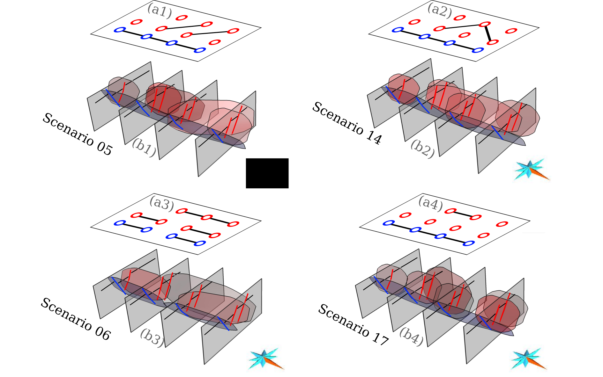

<style>
	body{
		margin:1em auto;
		max-width:55em;
		padding:0 .62em;
		font:1.2em/1.62 sans-serif;
	}
	h1,h2,h3 {
		line-height:1.2;
	}
	@media print{
		body{
			max-width:none
		}
	}
	img {
		max-width: 35em
	}
</style>


## Corresponding article

Godefroy, G., Caumon, G., Bonneau, F & Laurent, G., (2020). __Multi-scenario interpretations from sparse fault evidence using graph theory and geological rules__. _submitted to JGR: Solid Earth_.


```
@article{Godefroy2020submJGR,
 author = {Godefroy, Gabriel and Caumon, Guillaume and Laurent, Gautier and Bonneau, François},
 journal = {submitted to JGR: Solid Earth},
 title = {Multi-scenario interpretations from sparse fault evidence using graph theory and geological rules},
 year = {2020}
}
```


## The seismic data is NOT available but the seismic interpretation IS

The seismic data used in this article is the property of _PGS Investigação Petrolı́fera Limitada_ and cannot be shared along with this article. However, the seismic interpretation that we performed is provided (see Fig5). It can be easily visualized in the form of an interactive HTML page. We also provide the synthetic fault sticks used as input for the numerical experiments (Fig6 to Fig9).

The seismic interpretation was performed using SKUA-GOCAD. Software corresponding to this paper is available to sponsors in the RING software package FaultMod2. We provide the scenarios generated in the form of text files, along with Python scripts.

The Python script used to generate the Table1 is also provided.


## Table 3


 * Python script used to generate the Bell numbers:
	* [bell_number.py](Table3/bell_number.py.txt)
 * and the numerical values
	* [bell_number.txt](Table3/bell_number.txt)

 
## Figure 4 
<a href="Fig4"></a>



 * 3D viewer with different scenarios: 
	* [Fig4.html](Fig4/Fig4.html)
 * The coordinates 
	* of the synthetic seismic interpretation can be find here:
		* [Synthetic seismic interpretation](Fig4/lines.js)
	* of the surfaces of the corresponding scenarios can be find here: 
		* [Scenario 0](Fig4/surf0.js)
		* [Scenario 2](Fig4/surf2.js)
		* [Scenario 5](Fig4/surf5.js)
		* [Scenario 6](Fig4/surf6.js)
		* [Scenario 8](Fig4/surf8.js)
		* [Scenario 12](Fig4/surf12.js)
		* [Scenario 14](Fig4/surf14.js)
		* [Scenario 17](Fig4/surf17.js)

The structural models are conceptual; there is no scale.

## Figure 5


### 3D viewer 

 * 3D viewer with the used fault surfaces and generated synthetic fault sticks (coordinates not at scale): 
	* [Fig5.html](Fig5/Fig5.html)
 	* the corresponding surfaces can be found as _.js_ files:
		* e.g., [3 seismic lines' case](Fig5/L3.js)
		* e.g., [fault F52](Fig5/S11.js)


### Coordinates for the fault surfaces and synthetic interpretation (at scale)

The coordinates of the fault surfaces and synthetic fault sticks are also provided. 

### Fault surfaces
The text files containing the triangulated fault surfaces is format as follow:

```
 * First line _P T 0 0 0_:
	* _P_ is the number of points
	* _T_ is the number of triangles
 * The _P_ following lines contains the _x y z_ coordinates of the points
	* _x_ and _y_ are expressed in meters
	* _z_ is expressed in milliseconds
 * The _T_ last lines contains the description of each triangle
	* indices refers to the indices (starting at 1) of the _X_ first lines
```

Link to the files:

|   |   |   |   |
|---|---|---|---|
|  [Fs01](Fig5/faultsurfaces/avs_Fs01_fault.avs) | [Fs02](Fig5/faultsurfaces/avs_Fs02_fault.avs)  | [Fs03](Fig5/faultsurfaces/avs_Fs03_fault.avs) |  [Fs04](Fig5/faultsurfaces/avs_Fs04_fault.avs) |
| [Fs05](Fig5/faultsurfaces/avs_Fs05_fault.avs)  | [Fs06](Fig5/faultsurfaces/avs_Fs06_fault.avs) |  [Fs07](Fig5/faultsurfaces/avs_Fs07_fault.avs) | [Fs08](Fig5/faultsurfaces/avs_Fs08_fault.avs)  | 
| [F57](Fig5/faultsurfaces/avs_F57_fault.avs)  | [F58](Fig5/faultsurfaces/avs_F58_fault.avs) |  [F59](Fig5/faultsurfaces/avs_F59_fault.avs) | [F60](Fig5/faultsurfaces/avs_F60_fault.avs) |
| [F61](Fig5/faultsurfaces/avs_F61_fault.avs) |  [F62](Fig5/faultsurfaces/avs_F62_fault.avs) |  [F63](Fig5/faultsurfaces/avs_F63_fault.avs)  | [F64](Fig5/faultsurfaces/avs_F64_fault.avs) |  
| [F65](Fig5/faultsurfaces/avs_F65_fault.avs) | [F66](Fig5/faultsurfaces/avs_F66_fault.avs)  | [F67](Fig5/faultsurfaces/avs_F67_fault.avs) |  [F68](Fig5/faultsurfaces/avs_F68_fault.avs) |
| [F69bis](Fig5/faultsurfaces/avs_F69bis_fault.avs)  | [F69](Fig5/faultsurfaces/avs_F69_fault.avs) |  [F70](Fig5/faultsurfaces/avs_F70_fault.avs) | [F71](Fig5/faultsurfaces/avs_F71_fault.avs)  |
| [F72bis](Fig5/faultsurfaces/avs_F72bis_fault.avs) |  [F72](Fig5/faultsurfaces/avs_F72_fault.avs) | [F72ter](Fig5/faultsurfaces/avs_F72ter_fault.avs)  | [F73](Fig5/faultsurfaces/avs_F73_fault.avs) |

### Synthetic interpretation

 * [Synthetic interpretation from 3 lines](Fig5/seismictraces/From3Lines.txt)
 * [Synthetic interpretation from 4 lines](Fig5/seismictraces/From4Lines.txt)
 * [Synthetic interpretation from 5 lines](Fig5/seismictraces/From5Lines.txt)
 * [Synthetic interpretation from 6 lines](Fig5/seismictraces/From6Lines.txt)

Note: the _z_ coordinates is in milliseconds.

## Figure 6


Find below a 3D viewer with the graph of 

 * [Fig6.html](Fig6/html/Fig6.html)

The corresponding association weights are given in the text files located [here](Fig6/raw_graph)


